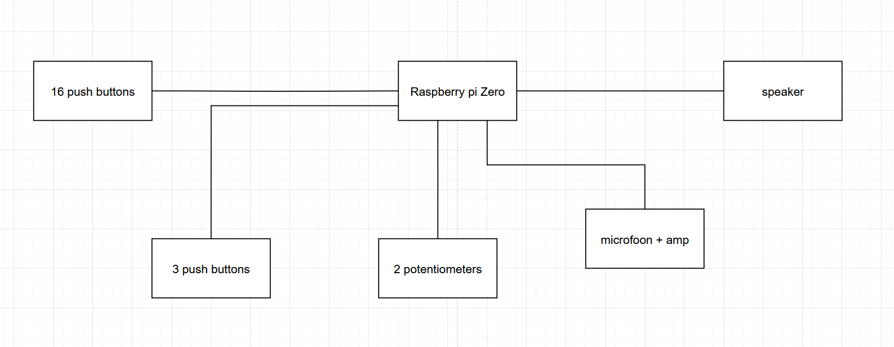

# IB3-Project
## Beschrijving
Dit project bestaat uit een drummachine die gebruikt wordt om drumsequenties af te spelen. Deze drummachine heeft 16 drukknoppen waarmee verschillende stappen in de sequentie geactiveerd kunnen worden en 16 selecteerbare geluiden die afgespeeld kunnen worden op de sequentie. 
Extra drukknoppen voor:
- het schrijven van geluid op een stap in de sequentie.
- het selecteren van lagen.
- het opnemen van geluid.
- het stoppen en starten van de sequentie.
- Het tempo (snelheid) van de sequentie en het volume van de machine zijn instelbaar aan de hand van een potentiometer.

## Functionaliteiten
- 16 verschillende geluiden kunnen afspelen.
- Een geluid kunnen veranderen met de ingebouwde microfoon.
- Een geluid kunnen selecteren door op de bijhorende knop te drukken.
- Een geluid kunnen schrijven op een stap in de sequentie.
- Starten en stoppen van de sequentie met een play-knop.
- Er moeten verschillende lagen kunnen aangemaakt worden.
- De lagen moeten uit- en aangezet worden.
- Het tempo moet instelbaar zijn.
- Het volume moet instelbaar zijn.
- Met behulp van leds moet er feedback gegeven worden aan de gebruiker, zoals bijvoorbeeld: huidige modus en een visuele weergave van de sequentie.

## Beperkingen
- Per stap kan maximaal één geluid afgespeeld worden.
  
# Hardware analyse
## Controller
### Raspberry pi pico 2
Specificaties
- Processor kan tot 150Mhz
- 520KB SRAM
- 4MB on-board flash memory
- 26x multi-function GPIO pins, met 3 voor ADC
- 2xSPI, 2x I2C, 2x UART, 3x 12-bit 500ksps Analogue to Digital Convertor (ADC), 24x controllable PWM channels
- 2x Timer, 1x AON Timer
Voordelen
- goedkoop
- klein
- veel IO-pins
- meerdere ADC pinnen
- timer
Nadelen
- geen sd-card
### Waarom kiezen voor Raspberry pi pico 2 ?
De Raspberry pi pico 2 heeft 12-bit 500ksps ADC poorten waarmee we potentiometers kunnen inlezen en eventueel een microfoon. De Raspberry pi heeft ook genoeg pinnen om al onze drukknoppen en leds aan te sturen. 
### Raspberry pi zero
Specificaties
- 1GHz single-core CPU
- 512MB RAM
- Mini HDMI port
- Micro USB OTG port
- Micro USB power
- Micro sd card reader
- 26x multi-function GPIO pins 
- UART communicatie
- SPI communicatie
Voordelen
- ingebouwde sd-card reader
Nadelen
- geen ADC-poorten
- iets duurder
### Waarom kiezen voor Raspberry pi zero ? 
De Raspberry pi zero heeft een ingebouwde sd-cardreader wat het gemakelijk maakt om audio files rechtstreeks op de Pi op te slaan.
## Audio
### DFPlayer Mini MP3 Player
[Documentatie](https://wiki.dfrobot.com/DFPlayer_Mini_SKU_DFR0299)
- Sampling rates (kHz): 8/11.025/12/16/22.05/24/32/44.1/48
- 24 -bit DAC output, support for dynamic range 90dB , SNR support 85dB
- Fully supports FAT16 , FAT32 file system, maximum support 32G of the TF card, support 32G of U disk, 64M bytes NORFLASH
- A variety of control modes, I/O control mode, serial mode, [AD button](https://www.dfrobot.com/product-2267.html) control mode
- audio data sorted by folder, supports up to 100 folders, every folder can hold up to 255 songs
- 30 level adjustable volume, 6 -level EQ adjustable
Voordelen
- hoge sampling rates
- 24-bit DAC output
- Volume control
Nadelen
- te simplistisch
### Waarom kopen ? 
Wordt aangestuurd met UART. Kan aangestuurd worden met DC3.2V~5.0V, de pico heeft een 3.3V output pin. Kan een simpele speaker aansturen. Heeft zelf geheugen.
### Audio met PWM
Zelf een speaker kopelen aan een digitale pin, met weerstanden en condensatoren (hoe weet ik nog niet).
Voordelen
- leerrijk
- uitdagender
- goedkoop
Nadelen
- nog geheugen nodig
### Waarom kiezen voor DFPlayer Mini MP3 player ? 
Als we voor de zero gaan is dit een betere optie omdat we dan al een ingebouwde sd-card reader hebben. In het geval van de pico hebben we nog een externe module nodig om sd-card in te lezen.
 

## Microfoon
### Electret Microphone Amplifier - MAX4466 with Adjustable Gain
[Documentatie](https://www.adafruit.com/product/1063)
### Voordelen
- adjustable gain
- 2.4V VCC
- Ingebouwde preamp

## I/O
### ADC MCP3008
[Documentatie](https://www.microchip.com/en-us/product/mcp3008)
- 10-bit resolution
- 4 input channels
- SPI serial interface
- 200ksps at Vdd = 5v
- 75ksps at Vdd = 2.7
### buttons
20 Cherry mx switches
### potentiometers
2 100ohm potentiometers?

